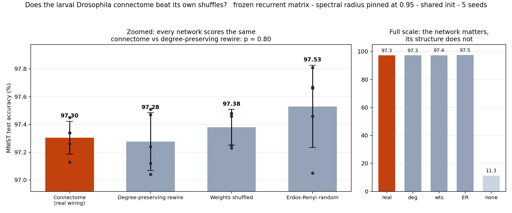
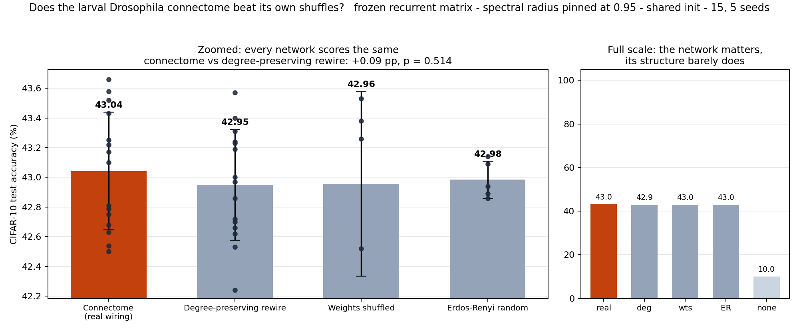

# Does the larval connectome actually beat its own shuffles?

**No — not on either task tested, at fifteen seeds, with the confounds pinned.**

A frozen *Drosophila* larva connectome is used as the recurrent layer of a
reservoir, trained on MNIST and CIFAR-10, and compared against null models that
destroy progressively more of its structure — with the confounds controlled.

Headline: against its own degree-preserving shuffle the gap is **+0.09 pp,
95% CI [−0.20, +0.38], p = 0.51**. Remove the recurrent network entirely and
accuracy falls to chance. *The network is load-bearing; its structure is not.*

## Why this exists

Two recent papers disagree, and neither released code.

**Biological Processing Units** ([arXiv:2507.10951](https://arxiv.org/abs/2507.10951))
froze the larval connectome (~3,000 neurons, ~65,000 weights), trained only the
input and output projections, and reported **98% on MNIST vs 97% for a size-matched
MLP** — concluding that biological wiring carries real computational advantage.
It ran no rewired-connectome control.

**Topological Sensitivity in Connectome-Constrained Neural Networks**
([arXiv:2604.04033](https://arxiv.org/abs/2604.04033)) took the fly *visual* connectome
in `flyvis` and showed that apparent topology advantages "largely disappear under
fair from-scratch initialization and degree-preserving controls." But it trained
for only **5 and 10 optimisation steps**, on a single task family, and listed
uncontrolled spectral properties among its own limitations.

So: one paper claims the advantage with weak controls, the other dissolves it with
strong controls but almost no training. This repo runs the missing experiment —
BPU's task and setup, Dhiman's control ladder, trained to convergence.

## The design

| | choice | why |
|---|---|---|
| Substrate | larval connectome, 2,956 neurons | Winding et al. 2023, via netzschleuder |
| Edges | 63,545 axon→dendrite (`ad`) synapses | canonical synapse direction; reproduces BPU's "~65,000 weights" |
| Input | 434 sensory neurons | the real injection site |
| Output | 346 descending neurons (DN-VNC + DN-SEZ) | the brain's real motor output |
| Frozen | the entire recurrent matrix | only input/output projections train — BPU's setup |
| Task | MNIST, 15 epochs to convergence | not 10 gradient steps |

### Three confounds, all controlled

1. **Spectral radius is pinned at 0.95 for every condition.** A reservoir's behaviour is
   dominated by the largest eigenvalue of its recurrent matrix. Without pinning it,
   "connectome vs shuffle" silently compares two *dynamical regimes* rather than two
   topologies. This is the control Dhiman names as missing.
2. **Shared initialisation.** At a given seed, every condition starts from byte-identical
   trainable parameters. The frozen matrix is the only difference.
3. **Dale's law, held fixed.** The larval dataset has no neurotransmitter labels, so
   excitatory/inhibitory signs are assigned per presynaptic neuron at random — using the
   *same* sign vector in every condition, so signs can never be what separates them.

### The control ladder

| condition | what is destroyed | what survives |
|---|---|---|
| `connectome` | nothing | the real wiring |
| `degree_preserving` | **who connects to whom** | every neuron's exact in/out degree |
| `weight_shuffle` | synapse strengths | the topology |
| `erdos_renyi` | everything | node and edge count only |

`degree_preserving` is the one that matters. It uses directed double-edge swaps —
`(a→b, c→d)` becomes `(a→d, c→b)` — so degree sequence is preserved exactly while
higher-order structure is destroyed (measured: clustering 0.111 → 0.033,
reciprocity 0.033 → 0.012, 99.9% of edges moved).

If the connectome's advantage is real topology rather than just its degree
distribution, `connectome` must beat `degree_preserving` by more than the seed spread.

## Results

**The connectome's specific wiring provides no detectable advantage on either task.**

### MNIST



5 seeds per condition, 15 epochs, mean ± sd:

| condition | accuracy | gap vs connectome | 95% CI | p |
|---|---|---|---|---|
| **Connectome (real wiring)** | **97.30% ± 0.12** | — | — | — |
| Degree-preserving rewire | 97.28% ± 0.21 | +0.03 pp | [−0.23, +0.29] | 0.80 |
| Weights shuffled | 97.38% ± 0.13 | −0.08 pp | [−0.26, +0.10] | 0.36 |
| Erdős–Rényi random | 97.53% ± 0.30 | −0.23 pp | [−0.59, +0.14] | 0.17 |
| No recurrence (floor) | 11.35% ± 0.00 | +85.95 pp | [+85.81, +86.10] | <0.0001 |

A uniformly random Erdős–Rényi graph is the numerically *best* condition; the real
brain places third of four.

### CIFAR-10



15 seeds for the headline pair, 5 for the remaining nulls:

| condition | accuracy | gap vs connectome | 95% CI | p |
|---|---|---|---|---|
| **Connectome (real wiring)** | **43.04% ± 0.40** (n=15) | — | — | — |
| Degree-preserving rewire | 42.95% ± 0.37 (n=15) | +0.09 pp | [−0.20, +0.38] | 0.51 |
| Weights shuffled | 42.96% ± 0.62 (n=5) | +0.09 pp | [−0.67, +0.84] | 0.78 |
| Erdős–Rényi random | 42.98% ± 0.12 (n=5) | +0.06 pp | [−0.19, +0.30] | 0.62 |
| No recurrence (floor) | 10.00% ± 0.00 (n=5) | +33.04 pp | [+32.82, +33.26] | <0.0001 |

### The seed count mattered, and this is why it was pre-registered

At **n = 5**, CIFAR-10 looked like a hit: gap **+0.35 pp, p = 0.078, Cohen's d = 1.276**
— a large effect, just short of significance, with the connectome ahead of all three
nulls. The tempting move is to call it suggestive and stop.

Instead the seed count was raised to 15 *with the result committed to in advance*,
whatever it turned out to be. It evaporated:

| | n = 5 | n = 15 |
|---|---|---|
| gap | +0.348 pp | **+0.093 pp** |
| Cohen's d | 1.276 | **0.241** |
| p | 0.078 | **0.514** |

Textbook winner's curse: small samples inflate effect sizes. A power analysis run
*before* the extra seeds put n=5 at only **42.7% power** even if d=1.276 were real —
worse than a coin flip. Had this stopped at n=5 and reported "suggestive", it would
have been reporting noise.

The same caveat applies to the MNIST numbers above: n=5 resolves only d ≥ 1.77.
Those results are reported as **"no detectable difference"**, never as "no difference".

### What this does and does not show

It does **not** show the connectome is uninformative in general. It shows that under
*this protocol* — a frozen reservoir scored on image classification — the fly's wiring
is indistinguishable from a random graph with the same size and degree sequence.
Destroying *who wires to whom* (99.9% of edges moved, clustering 0.111 → 0.033,
reciprocity 0.033 → 0.012) costs nothing measurable.

Meanwhile the network is genuinely load-bearing: remove recurrence and accuracy falls
to chance, because sensory and descending neurons are disjoint and no signal can cross.
So the reservoir does real work — **any** sufficiently connected graph does that work
equally well.

**Reproduction note.** On MNIST this reaches **97.3%** against BPU's reported **98%** —
the same effect. On CIFAR-10 it reaches **43.0%** against their **58%**, a 15-point
shortfall; their readout likely taps more of the network than the 346 descending
neurons used here. The *contrast* between conditions is internally valid regardless,
since every condition shares one protocol, but the absolute CIFAR-10 number does not
reproduce and that is worth flagging.

### Limitations

One substrate (larval), tasks the fly never evolved for, and n=15 still only resolves
d ≥ 1.02 — a genuinely tiny structural advantage would not be detected here. The upper
confidence bound is the honest ceiling: whatever the connectome contributes on these
tasks, it is smaller than **~0.4 percentage points**.

## Reproduce

```bash
pip install torch torchvision numpy pandas scipy matplotlib networkx

# fetch the connectome (2,956 neurons, 116,922 typed edges)
mkdir -p data && cd data
curl -sSLO https://networks.skewed.de/net/fly_larva/files/fly_larva.csv.zip
unzip -o fly_larva.csv.zip && cd ..

cd src
python run.py --conditions connectome degree_preserving erdos_renyi weight_shuffle \
              --seeds 0 1 2 3 4 --epochs 15
python analyse.py
```

Runs on a laptop. ~75s per condition-seed on an M-series GPU (MPS); 20 runs ≈ 25 minutes.

## Layout

```
src/connectome.py   load the connectome, build the null models, pin spectral radius
src/model.py        the frozen reservoir + a dense baseline
src/run.py          the control ladder runner
src/analyse.py      summary table, Welch t-test, figure
results/            results.json, control_ladder.png
```

## Data

Winding et al. (2023), *The connectome of an insect brain*, Science 379:eadd9330 —
obtained from [netzschleuder](https://networks.skewed.de/net/fly_larva) (`fly_larva`).

## License

MIT.
